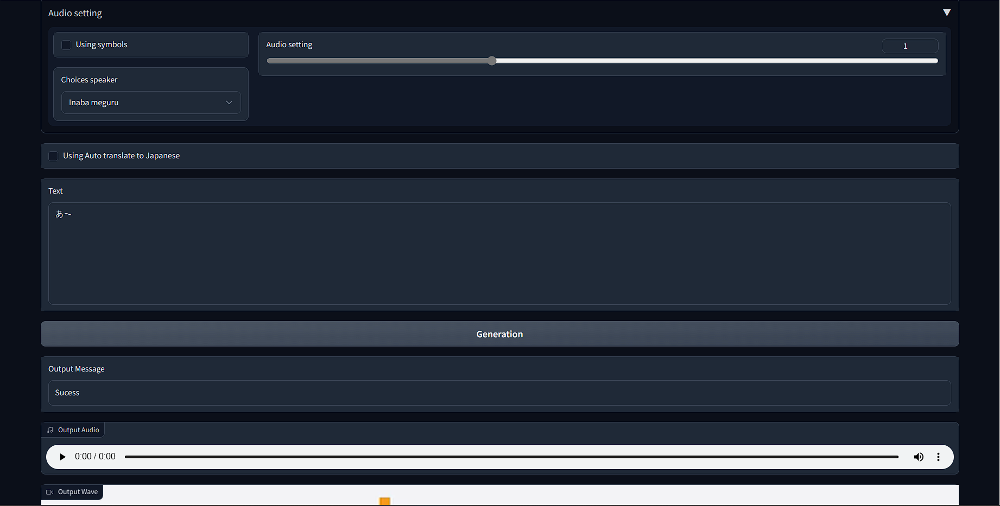

# The better web ui for MOE-TTS
Origin code in https://huggingface.co/spaces/skytnt/moe-tts.

Example: [](https://colab.research.google.com/drive/1oNJiT_e19E3GOprrcSP00gJN_0ZSBERV?usp=sharing).

Preview:



## Features:
- Text-to-speech, of course.
- Automatically translate into Japanese.
- CUDAAAAAAA! 
- API server.

## Used:

1. Install requirements:

```bash
pip install -r requirements.txt
```

2. Set up plugins:

```bash
cd plugins
python setup.py install
```

3. Web UI:

```bash
python app.py --displaywave
```

3. Or API Server:

```bash
python app.py --api
```

| Arguments     | Info |
|---------------| ----------|
| --displaywave | Display the sound wave screen in Web UI. |
| --device | Using which device? `CUDA` or `CPU`. |
| --share | To share the app with friends. |
| --api | Use only the api server. |
| --lang | What language to use for the UI. Default is `en`. |

## Model structure:

+ models/you_model_name/
- - model.pth
- - config.json (.yaml)
- - info.json (.yaml) (Options)
- - cover.jpg (Options)

## Unofficial demo for:

- [https://github.com/CjangCjengh/MoeGoe](https://github.com/CjangCjengh/MoeGoe)
- [https://github.com/Francis-Komizu/VITS](https://github.com/Francis-Komizu/VITS)
- [https://github.com/luoyily/MoeTTS](https://github.com/luoyily/MoeTTS)
- [https://github.com/Francis-Komizu/Sovits](https://github.com/Francis-Komizu/Sovits) <br>

## Very Thank:

- VITS : [Francis-Komizu](https://github.com/Francis-Komizu/VITS)
- Demo : [CjangCjengh](https://github.com/CjangCjengh/MoeGoe)
- Demo : [luoyily](https://github.com/luoyily/MoeTTS)
- Demo : [skytnt](https://huggingface.co/spaces/skytnt/moe-tts)
- You. 🫵


Multi translation by Google Translate API.
